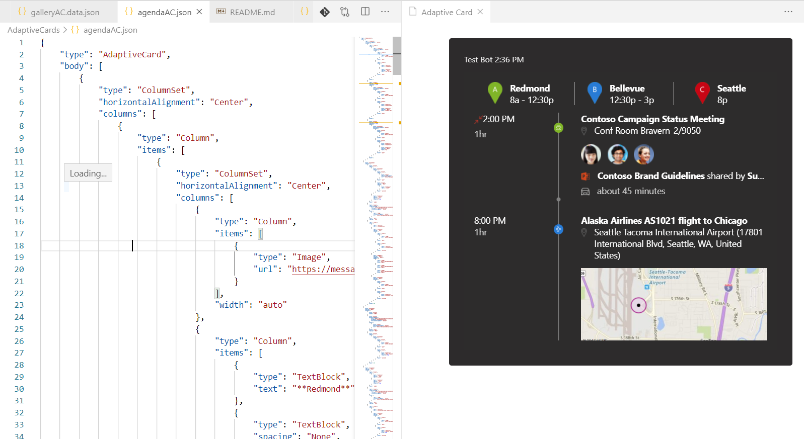
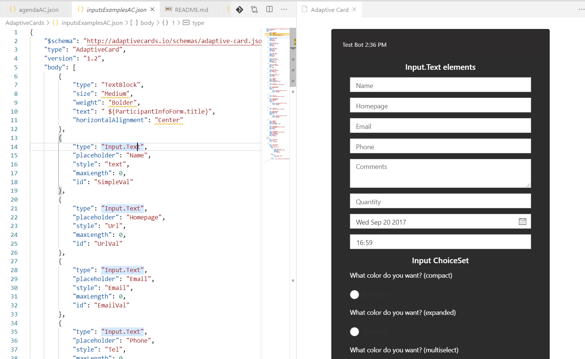
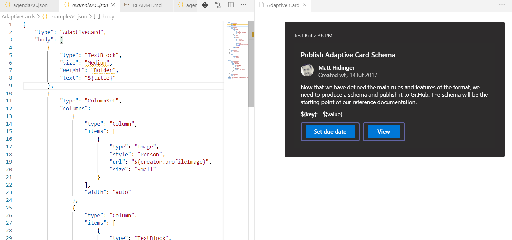
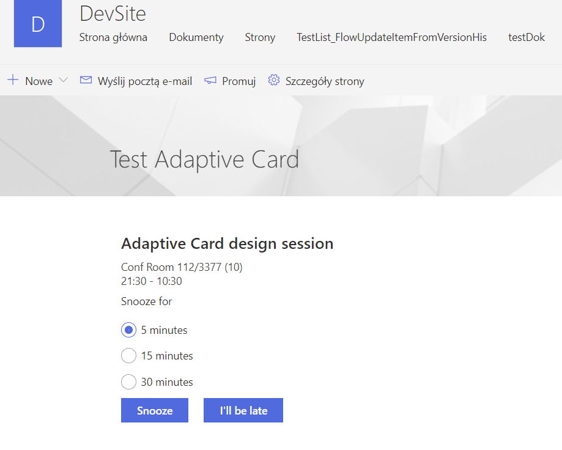
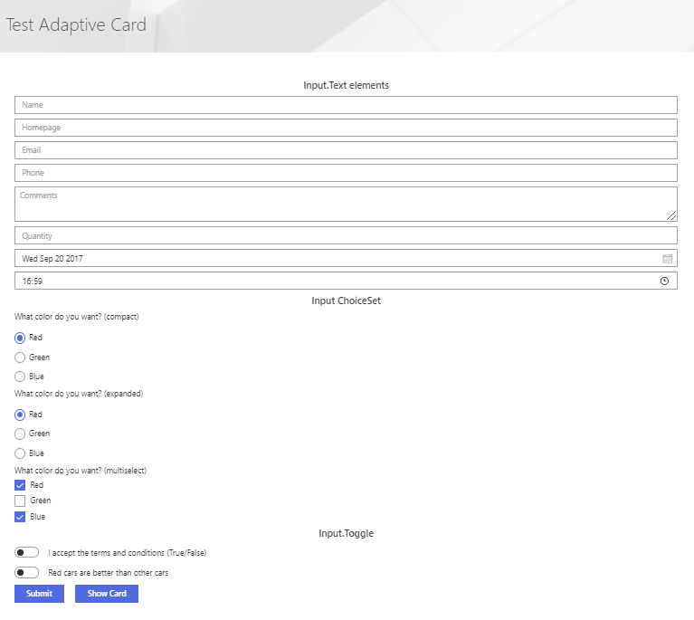

## Adaptive Cards

This part of repository store sample Adaptive Cards taken from samples and used/edited in Visual Studio Code and added to SharePoint page to present it in action

### exmaple:

Example adaptive card of agenda item

Example adaptive card of all possible inputs

Example adaptive card of person card

Adaptive card added to SharePoint page

### Development and install to SharePoint

test adaptive card json in online creator
https://adaptivecards.io/designer

developed in visual studio code thanks to extension
https://marketplace.visualstudio.com/items?itemName=tomlm.vscode-adaptivecards

deployed to SharePoint thanks to React Adaptive Card webpart taken from PnP samples
https://github.com/pnp/sp-dev-fx-webparts/tree/master/samples/react-adaptivecards