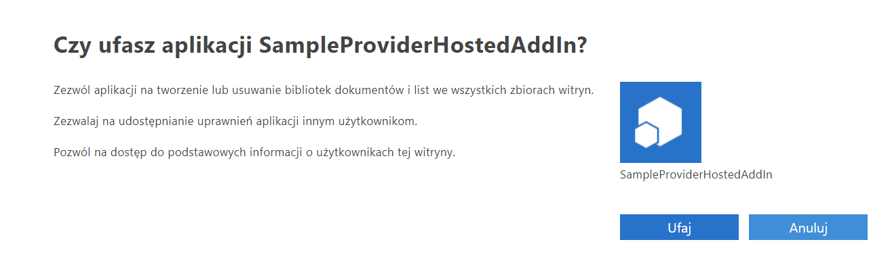
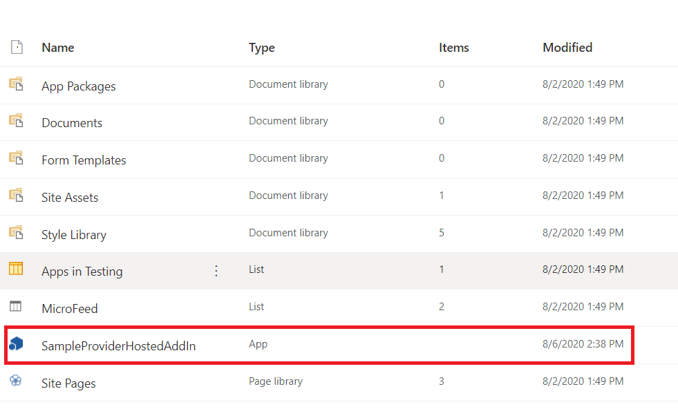
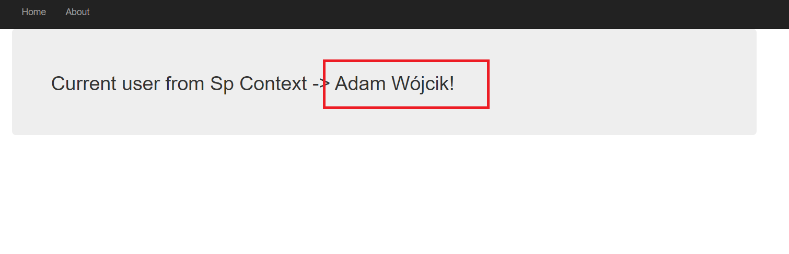
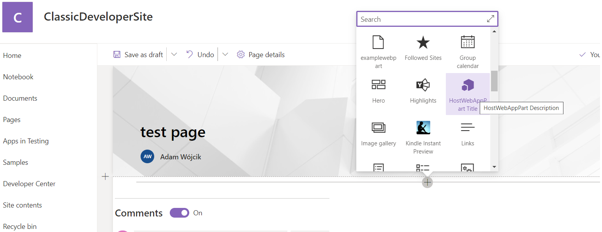
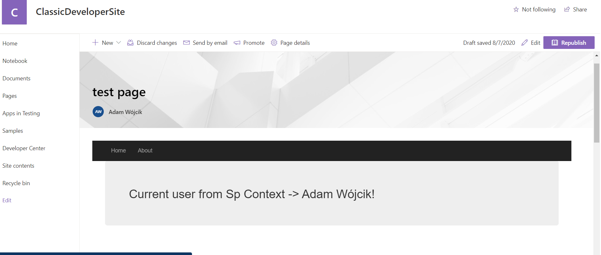

## SampleProviderHostedAddIn

This is a sample provider hosted Add-in. The web application is a standard .net framework MVC app which is added as a SharePoint provider hosted Add-in. The Add-in has also and host-web (app-part) which present the view from home controller. The MVC app just present the user login name from SharePoint context on the page.

### exmaple:

adding Add-in to SharePoint and approving it

Add-in present in site content

after clicking on the Add-in from site content the context is passed to the web MVC app

adding host-web (app-part) to page on site

homeController shown from host-web in the page
