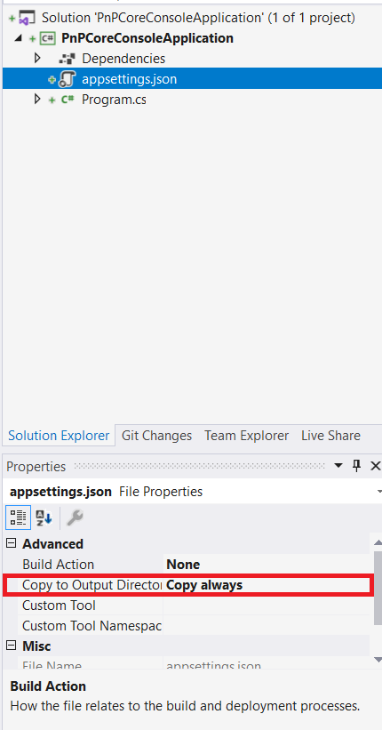
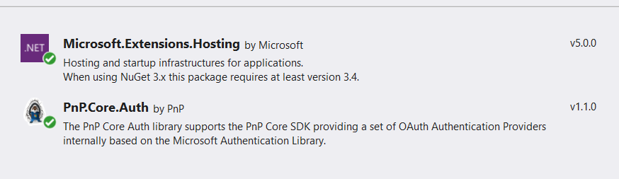
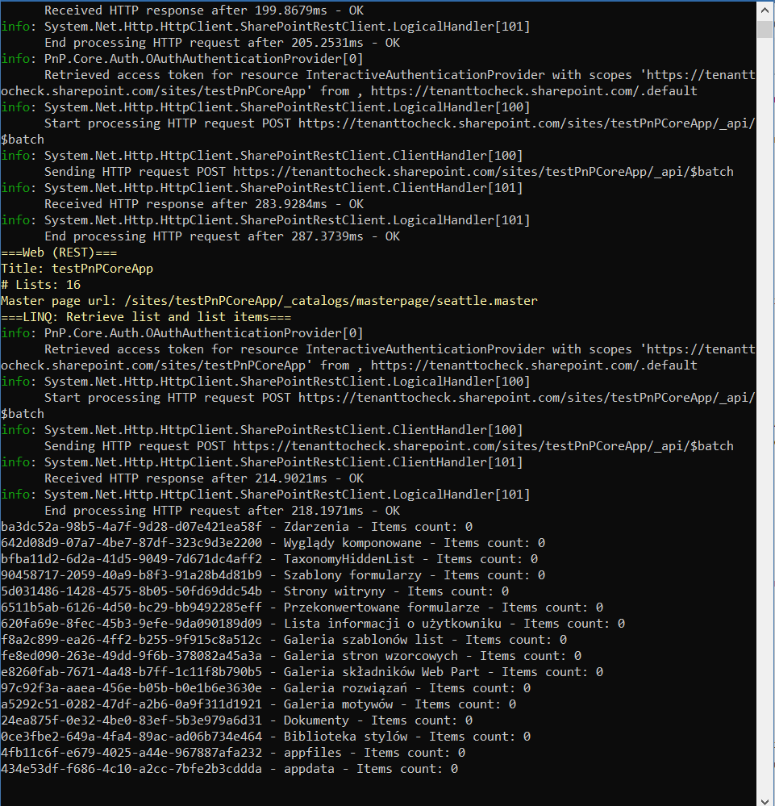

## PnPCoreConsoleApplication

#### Description

This project is a .NET Core console app that uses PnP.Core in .NET Core 3.1. In order for the app to work we need to register it in Azure AD with the required permissions for SharePoint and Graph defined in the spec.

----
#### MSDN 

PnP resource helpful to understand the used technology and modern authentication with CSOM for .NET Core 3.1.

https://pnp.github.io/pnpcore/using-the-sdk/configuring%20authentication.html

---
#### Example

app settings needs to be copied to output

nugets used in the project

output of the console app
