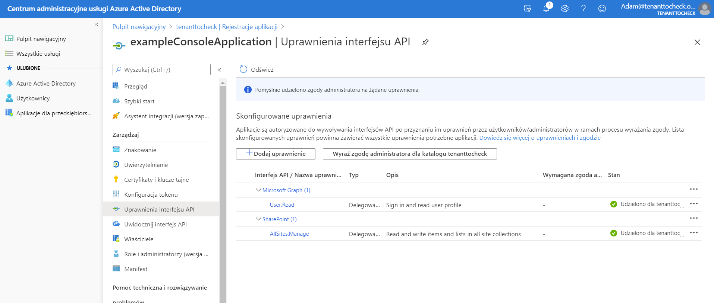

## exampleConsoleApplication

#### Description

This project is a .NET Core console app that uses SharePoint Online CSOM for .NET Standard. The app has an example implementation of modern authentication based on tokens and autorization via Azure Active Directory App registration. The app queries a list and add one item to it

----
#### MSDN 

MSDN resource helpful to understand the used technology and modern authentication with CSOM for .NET Standard.

https://docs.microsoft.com/en-us/sharepoint/dev/sp-add-ins/using-csom-for-dotnet-standard

---
#### Example

permission added in Azure AD for this app registration
