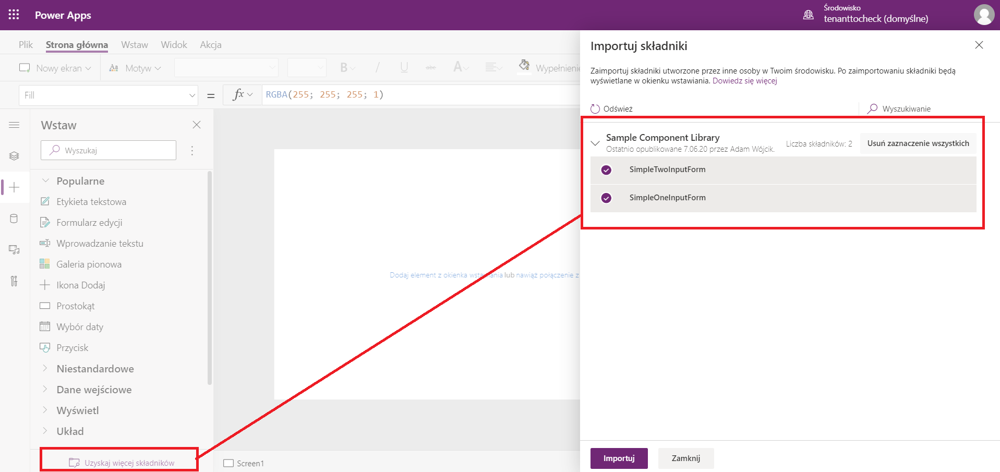

# CustomComponentLibrary

This is a sample Solution with a library of components that are used in a very simple canvas app

## Images
Two Components added to library

Library

Import Library Components to Canvas App

Use of Custom Components from library in Canvas App

Export Solution
