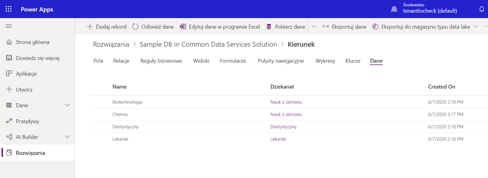

# CustomDBInCommonDataService

This is a small database made using CDS. The DB contains three tables:
Dziekanat
Kierunek with relation field to Dziekanat one to many
Student with relation field to Kierunke one to many

## Images
Solution contains

Custom Choice Data set

Dziekanat Table Data

Kierunek Table Data

Kierunek Table relation to Dziekanat Table one to many

Student Table

Student Table Forms

Customized form of add/edit student table row
