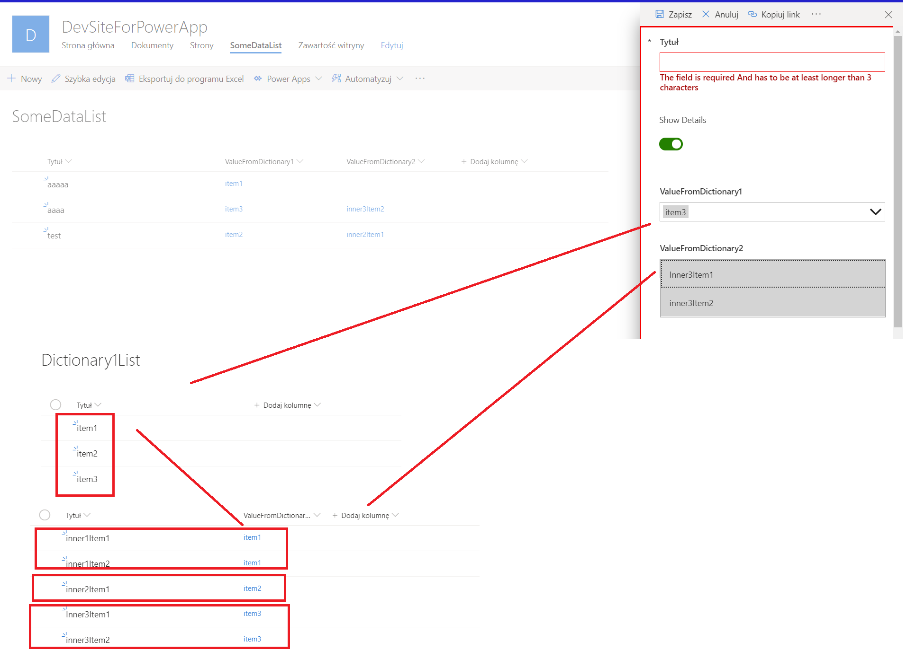
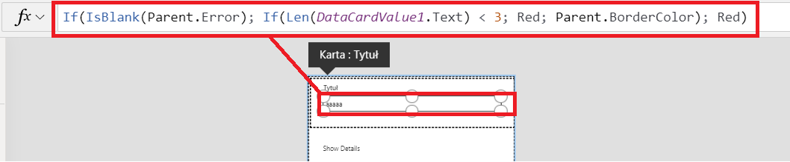
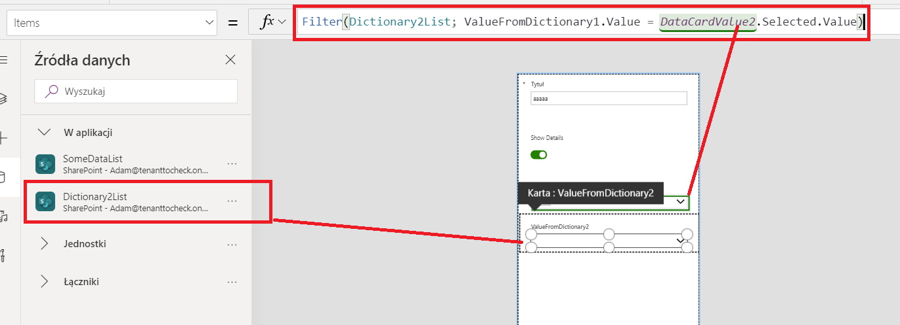
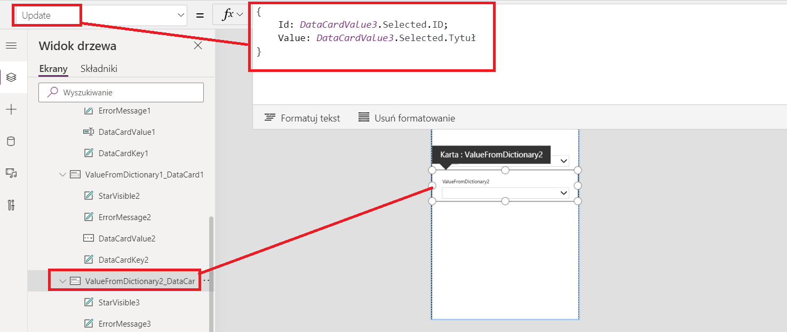

# Custom Form With Filtered Lookup Columns

This is a PowerApp which customizes a SharePoint list new and edit form. The PowerApp adds custom validation to text field that the value length cannot be less than 3 characters. The SharePoint List has two lookup columns to two dictionary SharePoint List. The second dictionary list has lookup column to the first list. The PowerApp filters values that are possible to select in second dropdown based ona  value selected in first dropdown.

## Images
Custom SharePoint List form with combobox with filtered values of second combobox based on selection from first

Custom validation on text field

Get items from SPList filtered based on selected item from other comboBox

Save lookup column value based on selected item from comboBox populated from other SPList
