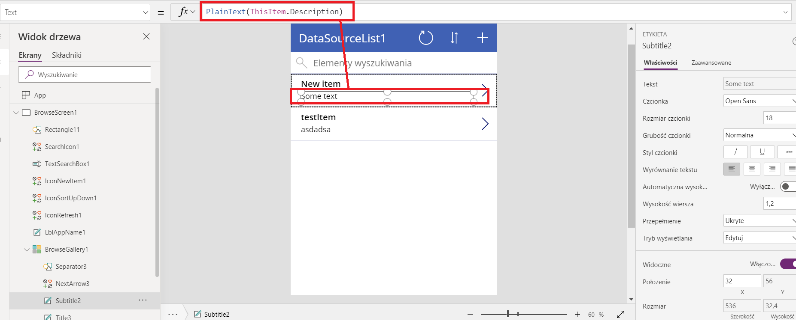
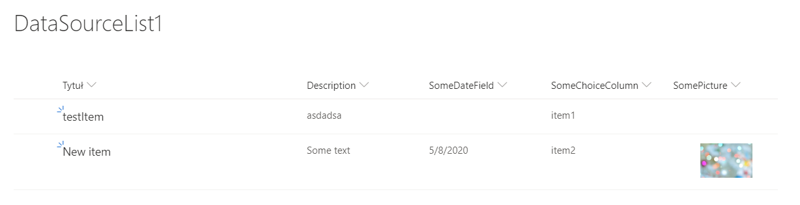
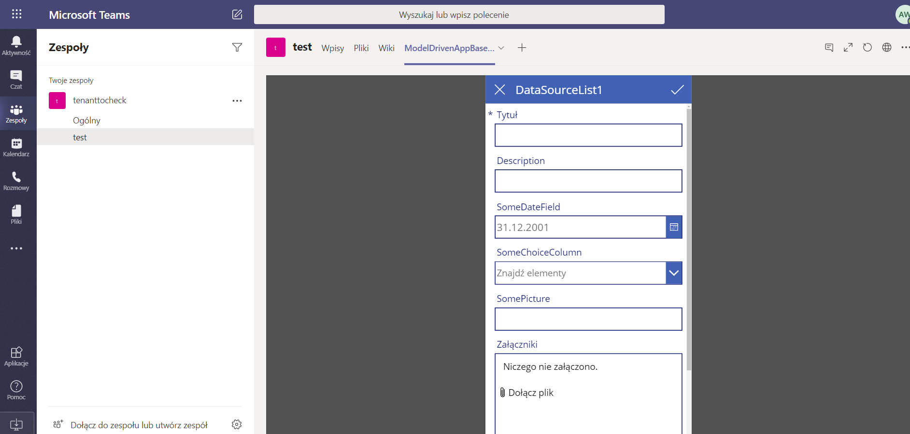
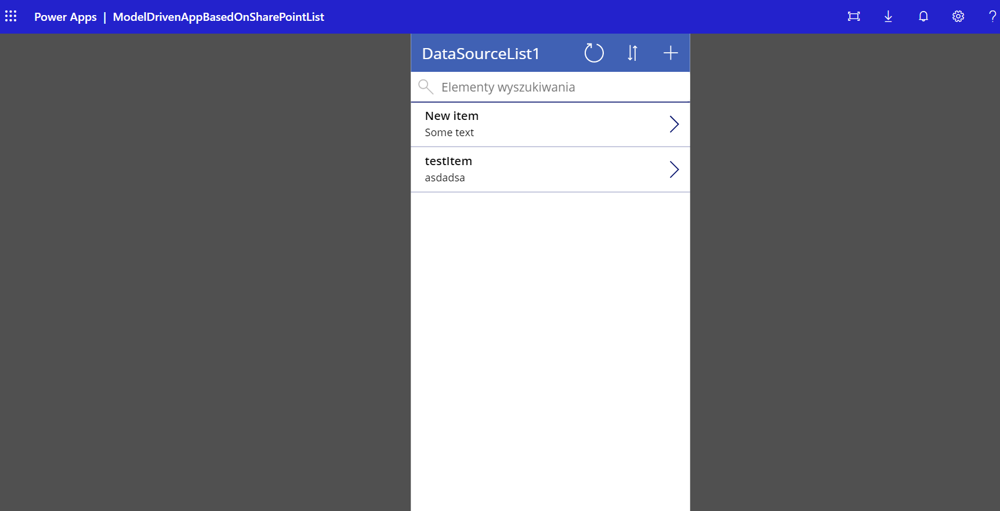

# Model Driven App

This is an example of model driven app based on data structure of SharePoint List. The app is used in Teams.

## Images
example how to present multiline text from sharepoint list column without the 
 tag

model on which the app was based

app present in Teams

app present in browser and mobile app
