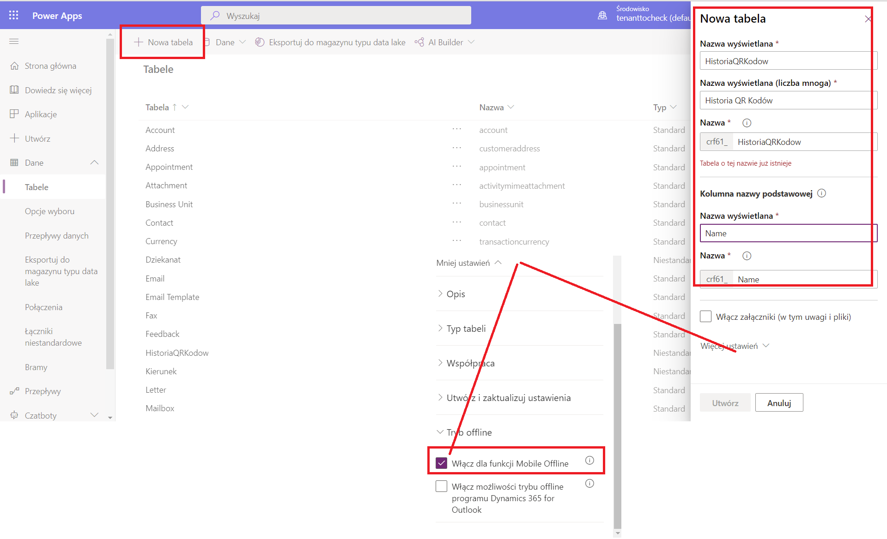
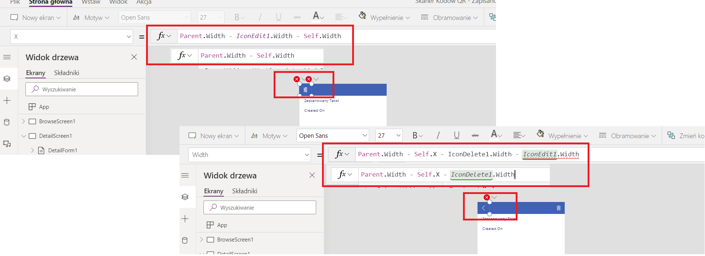

# QR Code Scanner

this is a mobile app that allows to scan any bar or QR code and save the result in history. The app allows to check the list of history scanned items, view details and delete them. The data is stored in common data service  

### Steps done to create the app

Adding a new table in common data service

Adding an app based on model

Deleing the not needed edit features

Adding a new screen that allows to scan qr code

Adding saving the scanned result to collection to db

Adding navigation between start screen and browser

