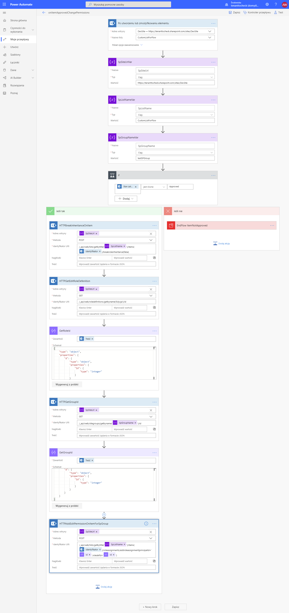
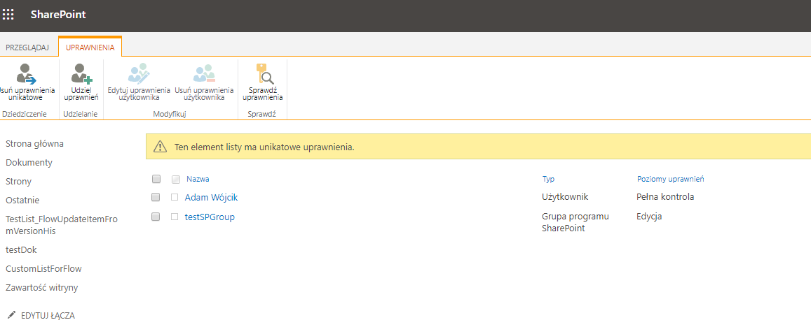
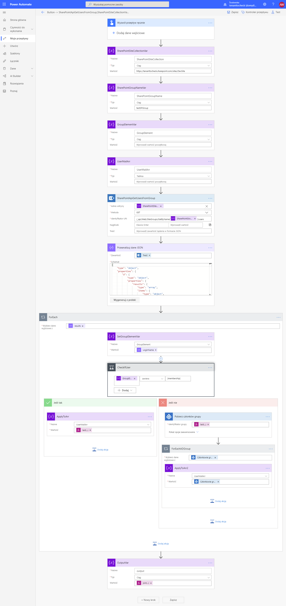
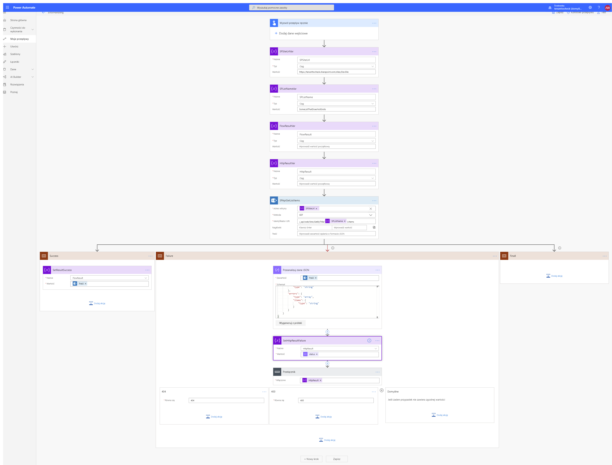
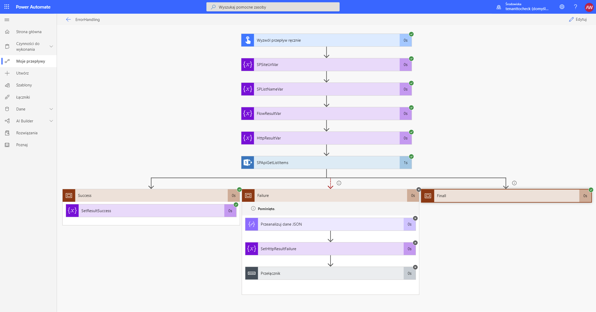
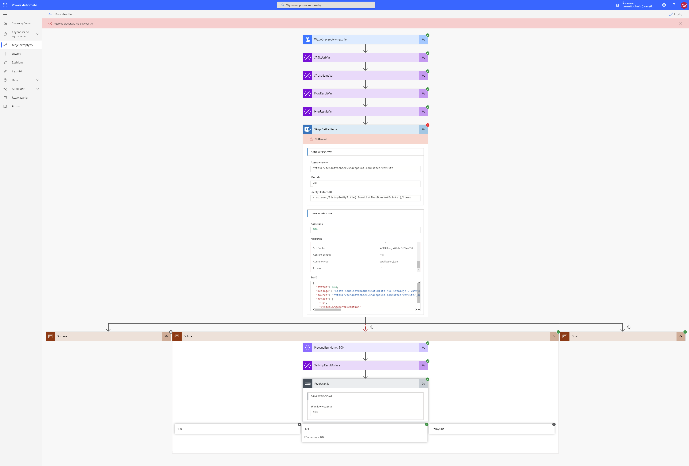
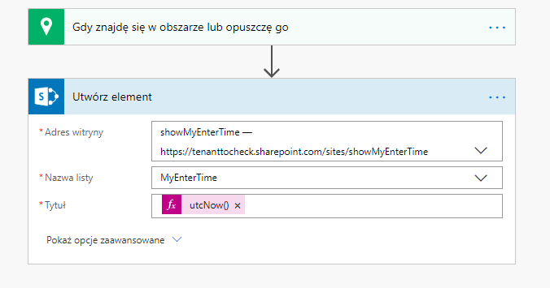
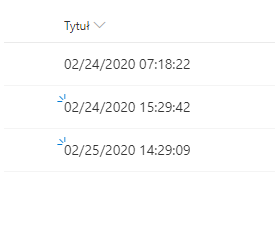

## PowerAutomate

#### Description

This project contains a set of power automate flows:
- BreakItemPermissionOnApproved -> this flow presents a solution to handle break item permission and manage permission on item after it was approved. The permissions on item get cleared and given group gets 'edit' role/permission on item

Flow defenition:

Flow result:

---

- GetUserMember -> this flow gets users mail from SharePoint group and also if in SP group was present an AD group the flow takes members from that AD group as well

Flow defenition:

---

- TryCatchExceptions -> this flow presents a solution to handle failures and success from HTTP requests. Also Final block is present that will run always regardless of the request status

Flow defenition:

When success:

When failure:

---

- WhenIEnterOrLeave -> this flow is triggered when a user with flow app enters or leaves a marked area and saves the current datetime on a SharePoint List

Flow defenition:

Flow result:

----
#### MSDN 

MSDN resource helpful to understand the used technology

https://docs.microsoft.com/en-us/power-automate/

---
#### Example

...
