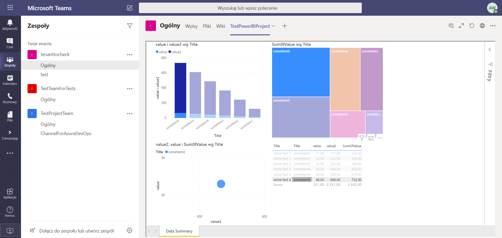

# PowerBI

This is a part of the repository stores a simple PowerBI report created from two tables from SharePoint that were connected via lookup column. The report uses data from both tables. In PowerBI I add a custom relation one to many using the lookup column and I add a custom sum column that add the values. The report is then published to PowerBI dashboard serwer and used in SharePoint site in PowerBI webpart and added as a Teams Tab

## Images
Two lists in SharePoint site connected using look up column

The lists are mapped into PowerBI desktop

Created a custom one to many relation using the lookup column

Created a new column based on custom formula

PowerBI Report

Report added to PowerBI dashboard

Report present in SharePoint Site

Report present in Teams as a new Tab
