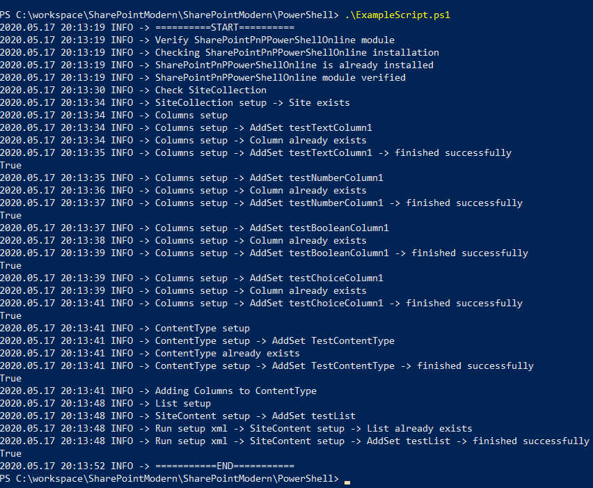
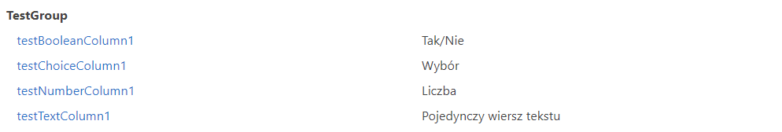
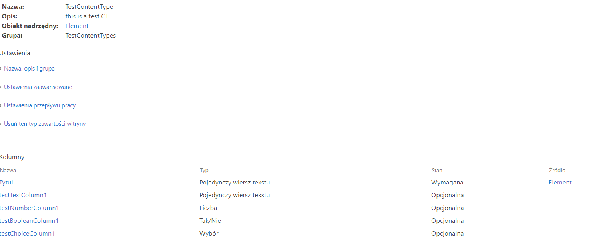
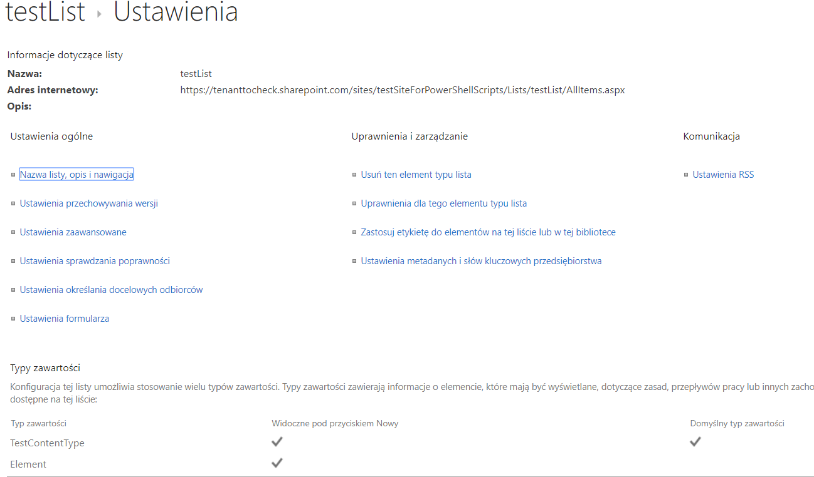
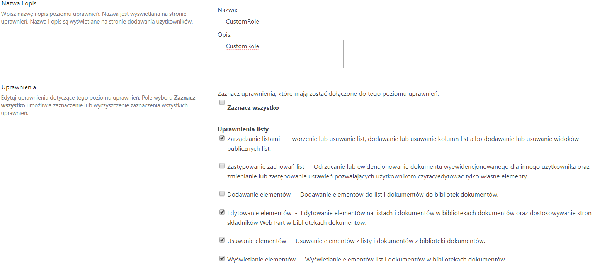
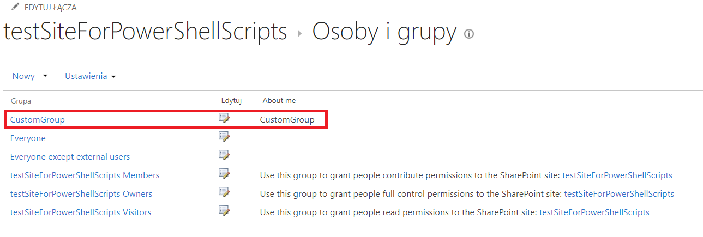

## PowerShell Examples with PnPSharePointOnlinePowerShell

Here I use SharePointPnPPowerShellOnline library to add columns, content types and list as an example of its usage.
I also present how to build custom PowerShell library module to use public and private methods logic.
This is only an exmaple of usage of PnP library but for sure the best option to add columnt, content types etc is to use 
Get-PnPProvisioningTemplate and Apply-PnPProvisioningTemplate

### exmaple:
Example of running the script

Columns added via script

ContentType added via script and added columns to ContentType

List added via script with ConentType

Role added via script

Grou added via script with custom Role

