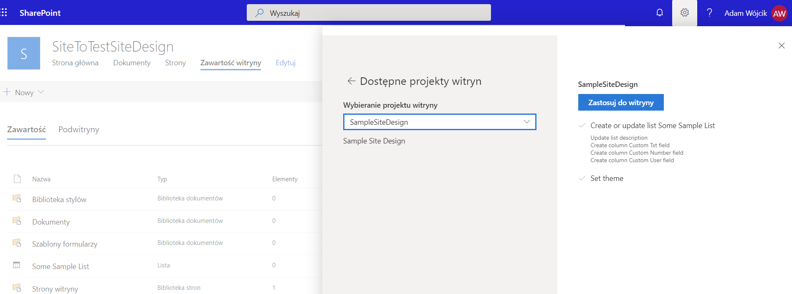
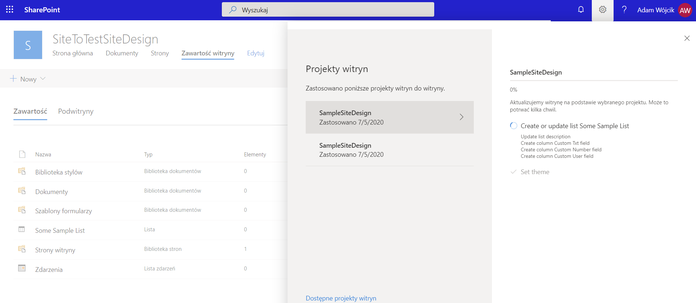
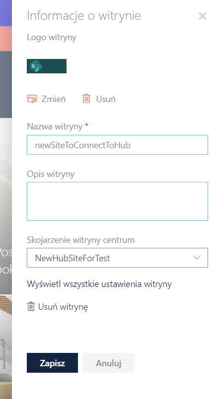

## SiteDesign

This project is a set of example site scripts (json files) and commands which allows to createa a site design and use it to apply to any site or apply to hub site. After that all pages added to this hub site will have the same site design applied

### exmaple:
pick site desings from the ones present in tenant 

site design running on the site

pick hub site to which site will be applied

result of applied site design on site which was added to hub site. Adding to hub site automatically applied site design

### MSDN 

MSDN resource helpful to understand site scripts and site designs

https://docs.microsoft.com/en-us/sharepoint/dev/declarative-customization/get-started-create-site-design
https://docs.microsoft.com/en-us/sharepoint/dev/declarative-customization/site-design-overview
https://github.com/pnp/sp-dev-site-scripts
https://docs.microsoft.com/pl-pl/sharepoint/set-up-site-design-hub-site
