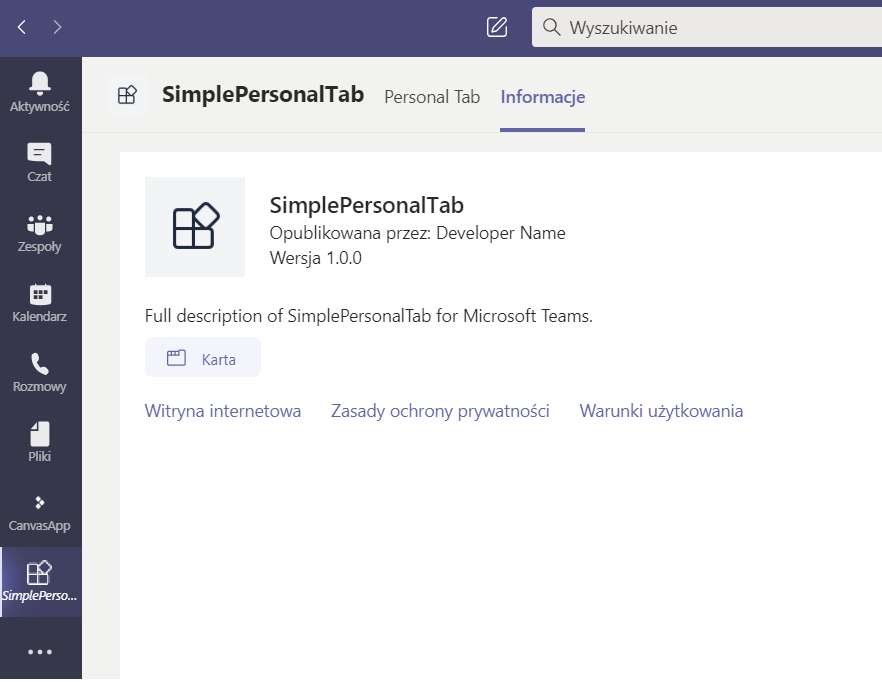

## SimplePersonalTab

This is a sample React web page project which is added as a personal tab in Teams

### Exmaple
Sync SPfx webpart to Teams

### Description

Tabs are Teams-aware webpages embedded in Microsoft Teams. Personal tabs are scoped to a single user. They can be pinned to the left navigation bar for easy access.

### Prerequisites
-  [NodeJS](https://nodejs.org/en/)

-  [M365 developer account](https://docs.microsoft.com/en-us/microsoftteams/platform/concepts/build-and-test/prepare-your-o365-tenant) or access to a Teams account with the appropriate permissions to install an app.

### Build and Run

In the project directory, execute:

`npm install`

`npm start`

### Deploy to Teams

**Launch app from VS Code**
- Prerequisites:
  - [Add a trusted certificate for localhost](https://aka.ms/teams-toolkit-trusted-cert)
  - [Enable Teams developer preview mode](https://aka.ms/teams-toolkit-enable-devpreview)

- Navigate to the activity bar on the left side of the Visual Studio Code window.
- Select the Run icon to display the Run and Debug view.
- You can also use the keyboard shortcut Ctrl+Shift+D. 

**Upload app from the Teams client**
- You can also upload the `Development.zip` from the *.publish* folder to Teams.
  - [Upload a custom app](https://aka.ms/teams-toolkit-uploadapp) 