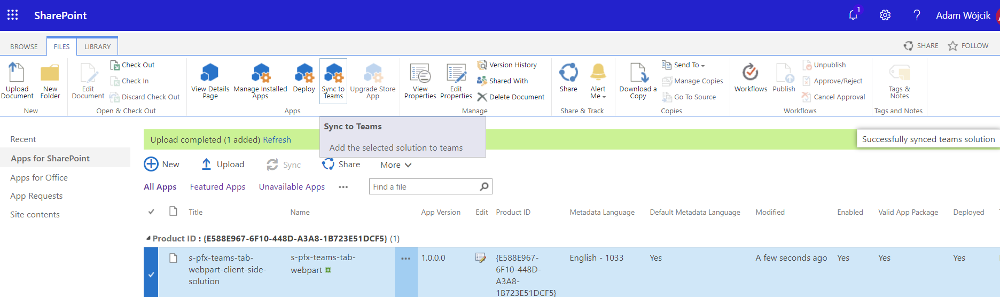
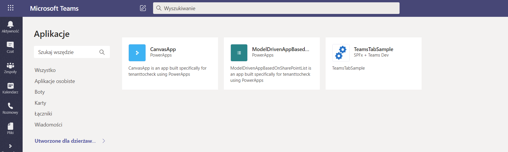
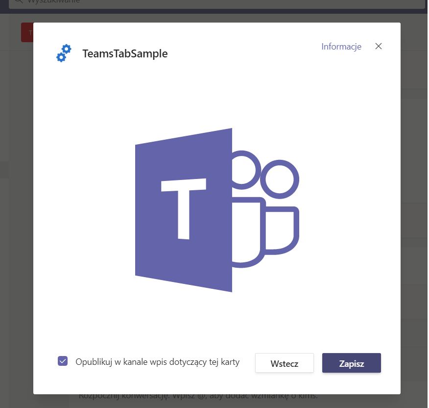
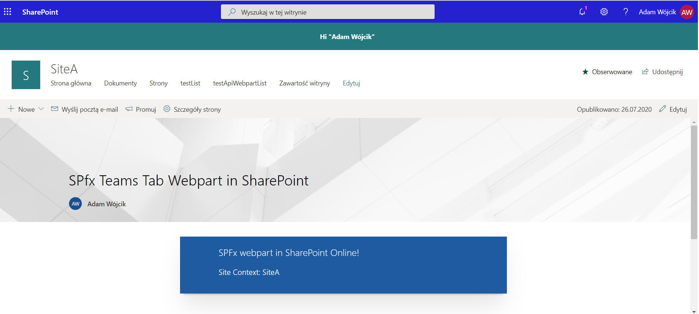
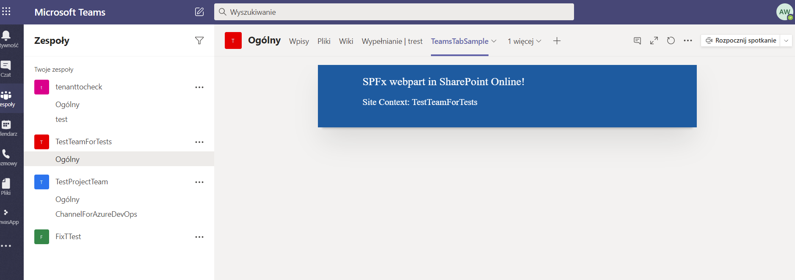

## SPfxTeamsTabWebpart

This is a sample SPfx webpart that is configured as Teams tab and uses teams context when possible.

### exmaple:
Sync SPfx webpart to Teams

SPfx webpart possible to add in teams

Adding webpart

Webpart in SharePoint

Webpart in Teams

### This package produces the following:

* lib/* - intermediate-stage commonjs build artifacts
* dist/* - the bundled script, along with other resources
* deploy/* - all resources which should be uploaded to a CDN.

### Build options

gulp clean
gulp test
gulp serve
gulp bundle
gulp package-solution