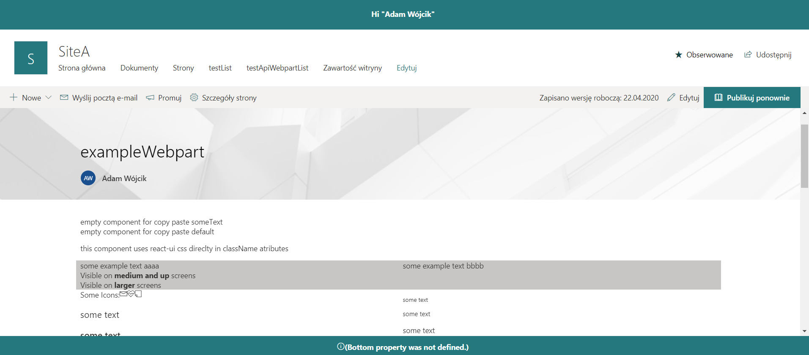

## ApplicationCustomizerExample

this is a sample application customizer extension that presents overrides header and footer of sitecollection to present custom data.

### exmaple:

### This package produces the following:

* lib/* - intermediate-stage commonjs build artifacts
* dist/* - the bundled script, along with other resources
* deploy/* - all resources which should be uploaded to a CDN.

### Build options

gulp clean
gulp test
gulp serve
gulp bundle
gulp package-solution

