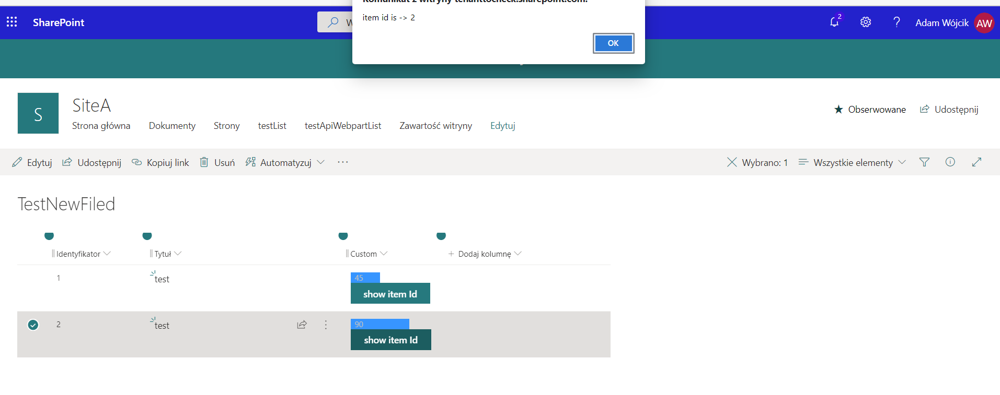
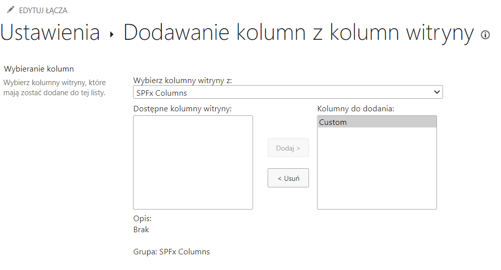

## FieldCustomizerExample

this is a sample field customizer that present an custom look of a column which shows value as progress bar with button which after click gets current item (row) Id

### exmaple:
example of custom field in list shows value as progress bar with button which after click gets current item (row) Id.

example how to add new column from list settings. Column aviable from columns in sitecollection after SPfx was added to site content.

### This package produces the following:

* lib/* - intermediate-stage commonjs build artifacts
* dist/* - the bundled script, along with other resources
* deploy/* - all resources which should be uploaded to a CDN.

### Build options

gulp clean
gulp test
gulp serve
gulp bundle
gulp package-solution
