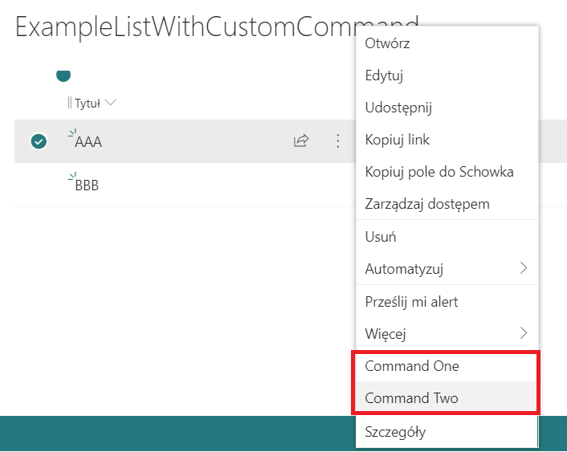

## ListViewCommandSet

this is a sample list view command set project that adds two buttons in the context menu of every list that is present on this sitecollection where the project is added.

### exmaple:

### This package produces the following:

* lib/* - intermediate-stage commonjs build artifacts
* dist/* - the bundled script, along with other resources
* deploy/* - all resources which should be uploaded to a CDN.

### Build options

gulp clean
gulp test
gulp serve
gulp bundle
gulp package-solution

