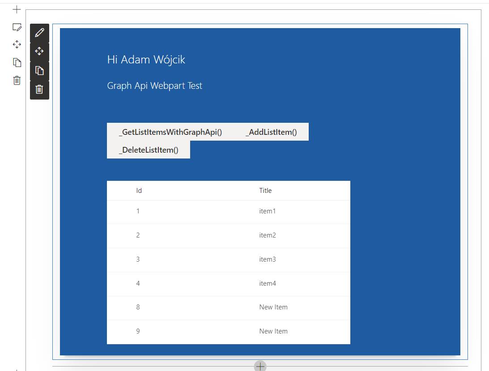
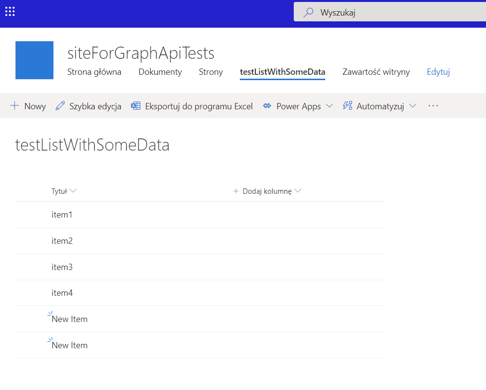

## simplelearningexample

this is a sample webpart that presents basic operations made using Graph API.. the webpart gets basic user information, list items from SharePoint list, adds and item and deletes it.

### exmaple:
how the webpart looks like

list to which the webpart adds and deletes item

### This package produces the following:

* lib/* - intermediate-stage commonjs build artifacts
* dist/* - the bundled script, along with other resources
* deploy/* - all resources which should be uploaded to a CDN.

### Build options

gulp clean
gulp test
gulp serve
gulp bundle
gulp package-solution
