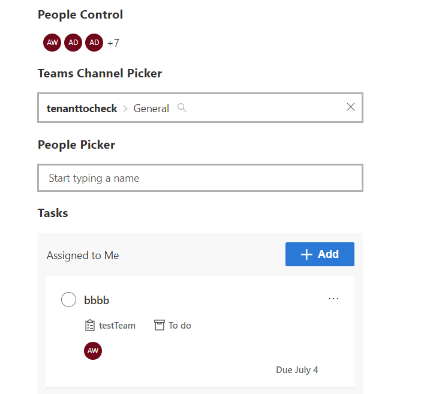
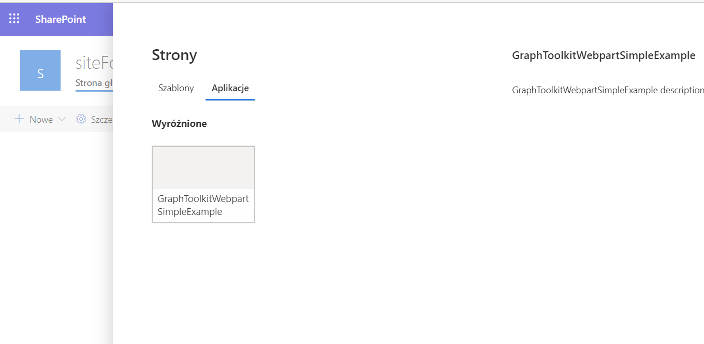
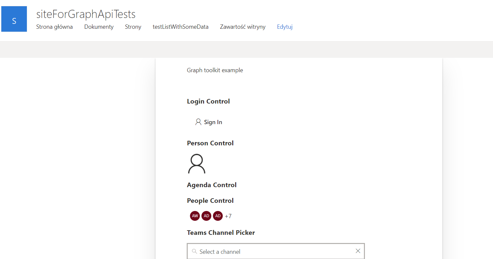
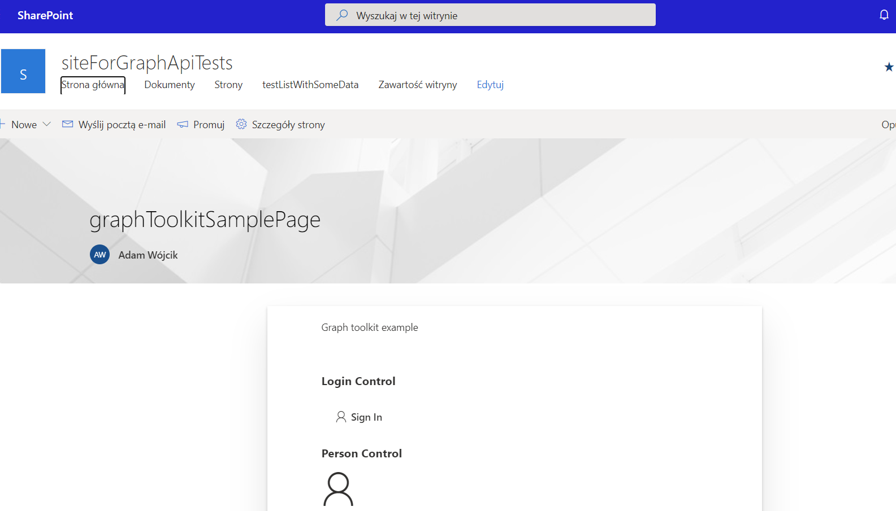

## graph-toolkit-webpart-simple-example

This projects uses graph toolkit components in webpart. The SPfx webpart is added to page and as an application in full page mode of page. The webpart is also possible to add as an Teams Tab

### exmaple:
some graph toolkit components used

adding graph toolkit as full page application mode

graph toolkit webpart in full page application mode

graph toolkit webpart in page

### This package produces the following:

* lib/* - intermediate-stage commonjs build artifacts
* dist/* - the bundled script, along with other resources
* deploy/* - all resources which should be uploaded to a CDN.

### Build options

gulp clean
gulp test
gulp serve
gulp bundle
gulp package-solution