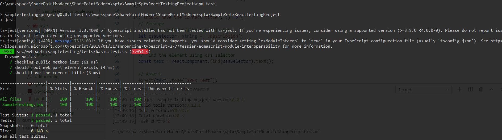

## sampleSpfxReactTestingProject

this is a sample react spfx webpart to that runs basic tests of react component

### exmaple:
run npm test command to run all unit tests

### This package produces the following:

* lib/* - intermediate-stage commonjs build artifacts
* dist/* - the bundled script, along with other resources
* deploy/* - all resources which should be uploaded to a CDN.

### Build options

* gulp clean
* gulp test
* gulp serve
* gulp bundle
* gulp package-solution
* npm test - to run all testing
