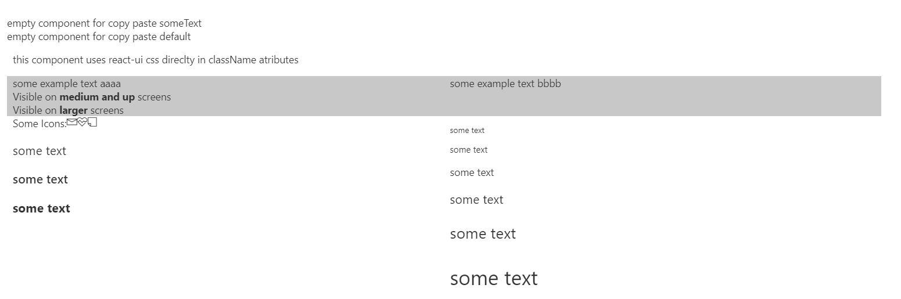
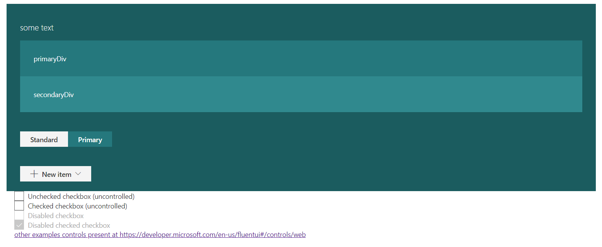

## simplelearningexample

this is a sample webpart that presents basic component management of react, use of fabric UI (Fluent UI) styles and controls, and contains a basic empty component for reause. The webpart uses theme styling in scss module

### exmaple:

### This package produces the following:

* lib/* - intermediate-stage commonjs build artifacts
* dist/* - the bundled script, along with other resources
* deploy/* - all resources which should be uploaded to a CDN.

### Build options

gulp clean
gulp test
gulp serve
gulp bundle
gulp package-solution
